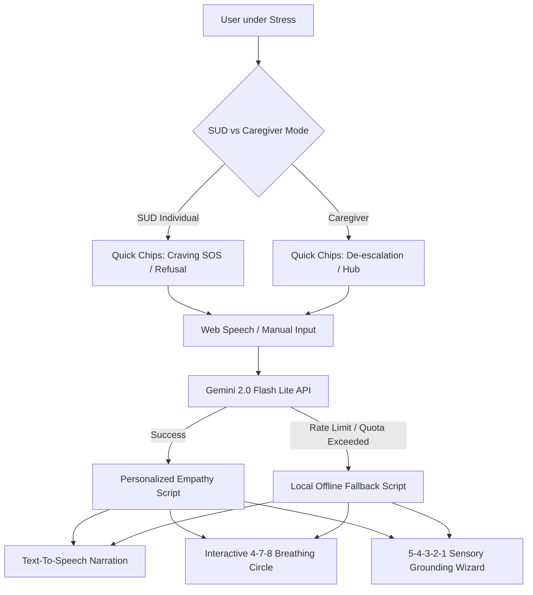

# Resilienta - GenAI SUD Recovery & Prevention Platform

Resilienta is a production-ready, highly accessible React + Vite + Tailwind CSS web application built as a multi-modal, GenAI-powered recovery and prevention platform. It supports individuals navigating Substance Use Disorder (SUD) and their caregivers during moments of high cognitive load.

**Submitted for the Hack2skill PromptWars Challenge.**

---

## 🎯 Chosen Vertical
**Substance Use Disorder (SUD) Recovery & Caregiver Support Platform**
*   **Target Users:** Recovering individuals experiencing intense physical cravings or social peer pressure, and family caregivers facing high-tension relapse risks or verbal conflict.
*   **Core Objective:** Mitigate distress and provide immediate, zero-typing therapeutic interventions in moments of panic, cognitive overload, or temptation.

---

## 🛠️ Approach & Architecture

### 1. Multi-Modal, Zero-Typing Design
During a craving peak, cognitive load is high, making typing or reading tiny text difficult. Resilienta solves this through:
- **Voice-First Input:** Integrated with the browser's native **Web Speech API** (`SpeechRecognition`), allowing users to speak their state directly.
- **1-Tap Quick Action Chips:** Direct, zero-typing entry buttons immediately load standard script templates without text input.
- **Aria-Live Speech Box:** Live feedback region reads speech transcripts aloud and updates dynamically.

### 2. Dual-Mode State Context
A central toggle switch changes the application's visual context and recommendations:
- **SUD Individual Perspective:** Recommends active craving mitigations and social substance-refusal script suggestions.
- **Caregiver Perspective:** Prioritizes tension de-escalation guidelines, boundaries education, and support resources.

### 3. Safe GenAI Engine Integration
Uses the `@google/generative-ai` SDK communicating securely with **Gemini 2.0 Flash Lite**.
- Prompts are engineered as structured crisis guidelines to return compassionate, step-by-step guidance.
- All requests are wrapped in clinical boundaries to prevent unsafe instructions.

---

## 💡 How the Solution Works



### 🔴 Emergency Scripts (GenAI Powered)
- **Active Craving SOS:** Prompts the GenAI to produce 3 simple physical actions (e.g. change posture, drink cold water, ground feet) and positive cognitive reframing statements.
- **De-escalation Script:** Formulates direct verbal scripts caregivers can say aloud to calm down a loved one during high conflict.
- **Refusal Generator:** Generates confident, polite statements to decline alcohol or drug offers in social settings.
- **Text-to-Speech (TTS) Reader:** Integrated Web Speech Synthesis reads the script aloud with simple Play/Stop controls, allowing users to close their eyes and listen.

### 🧘 Grounding & Calm Tools
- **4-7-8 Breathing Guide:** Interactive breathing sphere scaling in size (Inhale 4s, Hold 7s, Exhale 8s) synchronized with standard timers to drop heart rates.
- **5-4-3-2-1 Sensory Grounding Wizard:** Step-by-step interactive wizard directing attention to sight, touch, sound, smell, and taste to ground focus.

### 📚 Coping Resource Hub
- Interactive search field where caregivers ask custom boundaries questions and receive structured coping guidelines.
- Pre-seeded tiles covering boundaries setting, identifying early warning signs, and avoiding caregiver burnout.

---

## ⚠️ Assumptions & Fallback Protocols

### High-Reliability Offline Fallbacks
Because internet connectivity or API rate limits (such as HTTP 429 Quota Exceeded) can fail, Resilienta implements strict fallback protocols:
- **API Key Check:** If `VITE_GEMINI_API_KEY` is missing or empty, the app automatically boots in **Localized Protocol Mode**.
- **Rate Limit & Network Interceptor:** All API requests are wrapped in `try-catch` structures. On HTTP 429 or network timeout, the application grabs pre-verified clinical guidelines from standard SUD guides.

---

## 🚀 Local Setup & Deployment Instructions

### Prerequisites
Make sure you have Node.js (version 18+) and npm installed.

### 1. Installation
Clone the repository and install all dependencies:
```bash
npm install
```

### 2. Configure Environment Variables
Copy `.env.example` to a new file named `.env`:
```bash
cp .env.example .env
```
Open `.env` and enter your Gemini API Key from Google AI Studio:
```env
VITE_GEMINI_API_KEY=AIzaSy...your_gemini_key
```

### 3. Run Development Server
Start the local Vite development server:
```bash
npm run dev
```
Open your browser and navigate to the address displayed (usually `http://localhost:5173`).

### 4. Run Unit Tests
To run the automated tests via Vitest:
```bash
npm run test
```

### 5. Build for Production
To bundle and optimize the application for static deployment:
```bash
npm run build
```
This drops minified, chunk-split assets in the `dist/` directory, stripping out all console and debugging statements.
